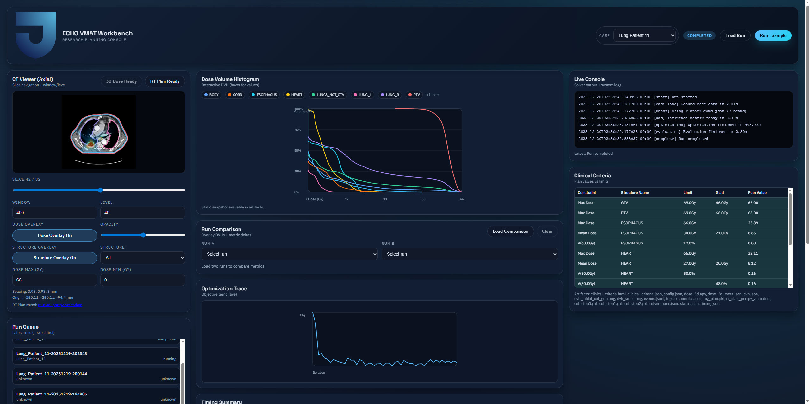

# TJU ECHO-VMAT Workbench



Local, research-only workbench for running ECHO-VMAT example patients, capturing plan quality (DVH + metrics), and timing the end-to-end optimization pipeline. The code wraps the official ECHO-VMAT example flow and avoids re-implementing solver logic.

## Current Status (Living Checklist)

- [x] Project scaffold created (`echo-workbench/` layout)
- [x] Python venv created (`echo-vmat-venv`, Python 3.10)
- [x] ECHO-VMAT cloned into `echo-workbench/echo-vmat`
- [x] ECHO-VMAT dependencies installed, MOSEK Python package installed
- [x] Runner wrapper (`backend/runner.py`) instrumented with timing + artifacts
- [x] Fast + super-fast modes for lower-resolution test runs
- [x] Adapter skeletons (example + Hugging Face)
- [x] FastAPI backend with run management + SSE logs + artifacts
- [x] Next.js UI with run setup, live logs, DVH, and clinical metrics
- [x] Interactive DVH plot (hover values, percent axes)
- [x] Run comparison (overlay DVHs + metric deltas)
- [x] CT viewer with window/level + wheel slice navigation (square viewport)
- [x] Structure overlay (per-slice outlines)
- [x] Optional 3D dose export + CT/dose color overlay
- [x] Population plan score dataset (99 lung patients, DVH-only, no beam data)
- [x] Plan score API + per-run plan score artifacts
- [x] Plan score UI (daisy plot + population tab with histogram)
- [x] RT Plan DICOM export (from ECHO template plan)
- [x] RT Dose DICOM export (per run)
- [x] CT DICOM export (per patient, generated once)
- [x] Standalone DVH + clinical criteria figure generator
- [~] Full-resolution example run validated (fast mode ok; full-resolution still pending)
- [ ] ESAPI adapter (future)

## Repository Layout

```
echo-workbench/
├── backend/                 # FastAPI app + runner
├── compressrtp/             # CompressRTP repo (submodule)
├── data/                    # dataset cache (raw/processed)
├── echo-vmat/               # ECHO-VMAT repo (submodule)
├── frontend/                # Next.js UI
└── README.md
```

## Quick Start

### 1) Submodule (ECHO-VMAT)
If you cloned this repo fresh:
```
git submodule update --init --recursive
```
This also pulls the CompressRTP submodule under `echo-workbench/compressrtp`.

### 2) Python venv
```
python -m venv echo-vmat-venv
source echo-vmat-venv/bin/activate
```

### 3) Install ECHO-VMAT requirements
```
python -m pip install -r echo-workbench/echo-vmat/requirements.txt
```
Optional (RT Plan export):
```
python -m pip install "portpy[pydicom]"
```
CompressRTP dependencies (wavelets + SVD helpers):
```
python -m pip install -r echo-workbench/backend/requirements.txt
```
Optional (GPU acceleration for supported CompressRTP steps):
```
python -m pip install cupy-cuda12x
```

### 4) Run the ECHO example (CLI)
```
/mnt/d/_PROJECTS/ECHO-VMAT_Project/echo-vmat-venv/bin/python \
  /mnt/d/_PROJECTS/ECHO-VMAT_Project/echo-workbench/backend/runner.py \
  --case-id Lung_Patient_11 \
  --data-dir /mnt/d/_PROJECTS/ECHO-VMAT_Project/echo-workbench/PortPy/data \
  --super-fast
```

### 5) Backend API
```
cd /mnt/d/_PROJECTS/ECHO-VMAT_Project/echo-workbench
python -m uvicorn backend.main:app --reload --port 8000
```
Faster dev server (limits watch scope, avoids large repo scan):
```
/mnt/d/_PROJECTS/ECHO-VMAT_Project/echo-workbench/scripts/dev_backend.sh
```
This script also disables access logs to keep errors visible.

### 6) Frontend UI
```
cd /mnt/d/_PROJECTS/ECHO-VMAT_Project/echo-workbench/frontend
npm install
npm run dev
```
Convenience dev script:
```
/mnt/d/_PROJECTS/ECHO-VMAT_Project/echo-workbench/scripts/dev_frontend.sh
```
Open: http://localhost:3000

UI notes:
- Load a run from the Run Queue.
- Click "Create 3D Dose" once to save `dose_3d.npy` for that run.
- Toggle Dose Overlay in the CT viewer (fast, no recompute).
- Use Run Comparison to overlay two DVHs and compute metric deltas.
- Use the Plan Score Population tab to compare reference plan score distribution vs the selected run.
- Use the top patient search bar to filter the run list to a single patient.
- Patient list is populated from population DVH metadata; search + filter at the top.
- Use the DICOM Exports panel to generate CT/RTSTRUCT and RTPLAN/RTDOSE.
- Add a run tag to label experiments and comparisons.
- The "Safe (low memory)" preset uses planner beams + sparse matrix to reduce RAM.
- Batch runs (sequential queue): POST `/runs/batch` and poll `/runs/batch/{batch_id}`.
- Use the Parameter Sweep card to launch a batch of runs with opt-parameter overrides.
- All runs are currently capped to 3 beams (memory-safe). Update `BEAM_LIMIT` in `echo-workbench/frontend/app/page.js` or send `beam_count` via API to change.

Parameter sweeps (ECHO-VMAT):
- Source config file: `echo-workbench/echo-vmat/echo_vmat/config_files/<protocol>_opt_params.json`
- Supported overrides:
  - `opt_parameters`: direct key overrides (e.g., `step_size_increment`, `termination_gap`, `inf_matrix_scale_factor`)
  - `objective_weight_scale`: scales `{ target, oar, aperture, dfo }`
  - `objective_weights`: explicit overrides `{ step, type, structure_name, weight }`
- CLI example:
```
python echo-workbench/backend/runner.py \
  --case-id Lung_Patient_11 \
  --protocol Lung_2Gy_30Fx \
  --beam-count 3 \
  --opt-params-overrides @/path/to/overrides.json
```
- API example (batch sweep):
```
curl -X POST http://127.0.0.1:8000/runs/batch \
  -H "Content-Type: application/json" \
  -d '{"label":"sweep-target","runs":[
        {"case_id":"Lung_Patient_11","protocol":"Lung_2Gy_30Fx","optimizer":"echo-vmat","beam_count":3,"opt_params_overrides":{"objective_weight_scale":{"target":0.8}},"tag":"target=0.8"},
        {"case_id":"Lung_Patient_11","protocol":"Lung_2Gy_30Fx","optimizer":"echo-vmat","beam_count":3,"opt_params_overrides":{"objective_weight_scale":{"target":1.0}},"tag":"target=1.0"},
        {"case_id":"Lung_Patient_11","protocol":"Lung_2Gy_30Fx","optimizer":"echo-vmat","beam_count":3,"opt_params_overrides":{"objective_weight_scale":{"target":1.2}},"tag":"target=1.2"}
      ]}'
```

CompressRTP notes:
- Select Optimizer = CompressRTP and choose a compression mode.
- Use Pipeline Step = DDC Only for fast validation runs.
- GPU toggle (optional) uses CuPy for supported matrix ops; solver remains CPU.
- For large matrices, GPU dose uses chunked transfers; set `ECHO_GPU_CHUNK_MB` to tune (default 512).
- For GPU compression (sparse+low-rank thresholding), set `ECHO_GPU_COMPRESS_CHUNK_MB` to tune chunk size (default 256).
- CompressRTP outputs are saved under `echo-workbench/backend/runs-compressrtp/<run_id>/`.
- The UI lists both ECHO-VMAT and CompressRTP runs with type labels.
Step diagnostics (CLI, stop after a stage):
```
python echo-workbench/backend/runner.py --optimizer compressrtp --step ddc --beam-ids 0,1,2
```
GPU (CLI):
```
python echo-workbench/backend/runner.py --optimizer compressrtp --gpu --beam-ids 0,1,2
```

Profiling + GPU feasibility notes:
- `docs/optimization_profiling.md`
- `docs/gpu_feasibility.md`

Baseline capture:
```
python echo-workbench/scripts/record_baseline.py --run-id <RUN_ID>
```

CT DICOM export (once per patient):
```
curl -X POST http://127.0.0.1:8000/runs/<run_id>/ct-dicom
```
RT Structure Set export (once per patient):
```
curl -X POST http://127.0.0.1:8000/runs/<run_id>/rtstruct
```

## Artifacts Per Run
All run outputs are saved under:
```
echo-workbench/backend/runs/<run_id>/
```
CompressRTP outputs are stored separately:
```
echo-workbench/backend/runs-compressrtp/<run_id>/
```
Key files:
- `config.json`, `status.json`, `timing.json`
- `metrics.json` (clinical criteria table)
- `dvh.json` + `dvh_steps.png`
- `solver_trace.json`
- `clinical_criteria.html` (shareable report)
- `dose_3d.npy` + `dose_3d_meta.json` (optional, generated on demand)
- `rt_plan_portpy_vmat.dcm` (optional, generated on demand)
- `rt_dose_portpy_vmat.dcm` (optional, generated on demand)

`timing.json` now includes stage durations (beams/compression) and peak RSS (`max_rss_mb`) for quick profiling.

CT DICOM (generated once per patient) is saved under:
```
echo-workbench/data/processed/dicom/<case_id>/ct/
```
RT Structure Set DICOM (generated once per patient) is saved under:
```
echo-workbench/data/processed/dicom/<case_id>/rtstruct/rt_struct_portpy.dcm
```

## Tests
CompressRTP integration smoke tests (may take time, uses Lung_Patient_11):
```
python -m unittest echo-workbench/backend/tests/test_compressrtp_integration.py
```
GPU utilities (skips if CuPy unavailable):
```
python -m unittest echo-workbench/backend/tests/test_gpu_utils.py
```
MOSEK license: ensure `mosek.lic` is present at repo root or set `MOSEKLM_LICENSE_FILE`.

## Data Management
- Raw data is expected under `echo-workbench/PortPy/data`.
- Hugging Face datasets cache to `echo-workbench/data/raw/huggingface/`.
- Raw data is never modified.
- Population plan score metadata (RTDOSE + structure masks only) is stored under:
  `echo-workbench/data/processed/plan-score/Lung_2Gy_30Fx/population_metrics.json`.

## Notes / Known Issues
- Full-resolution runs can be long and memory-heavy; use `--fast` or `--super-fast` for smoke tests.
- Some datasets may be missing `voxel_coordinate_XYZ_mm`; the runner computes a fallback using PortPy utilities.
- Warnings about DVH dose limits can appear if dose thresholds exceed max dose; these do not stop the run.

## License
PortPy uses Apache 2.0 with a Commons Clause (non-commercial research only). Review upstream license terms before distribution.
